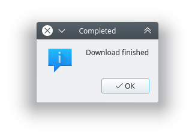

# youtube-dl-gui

A simple UI for [youtube-dl](https://github.com/ytdl-org/youtube-dl) app.

## Requirements

- [x] PyQt5

## TODO

- [ ] Separate progress for video and audio
- [ ] Replace prompt for already existing video
- [ ] Catch more errors like video not found, halfway crash etc
